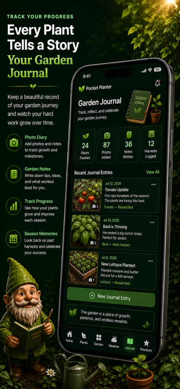
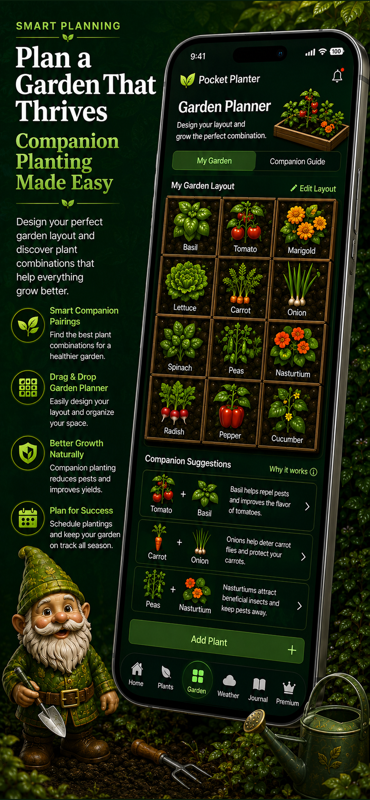
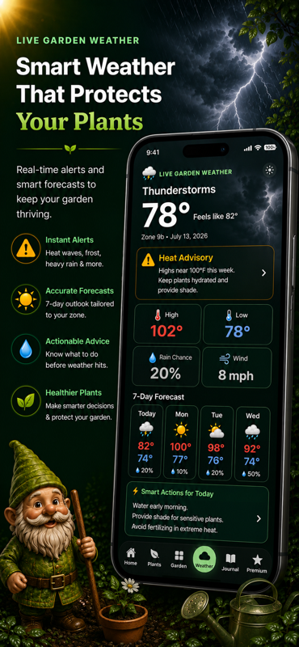
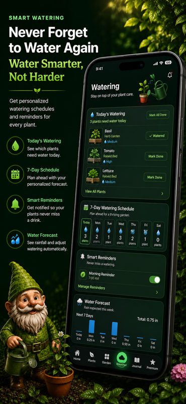
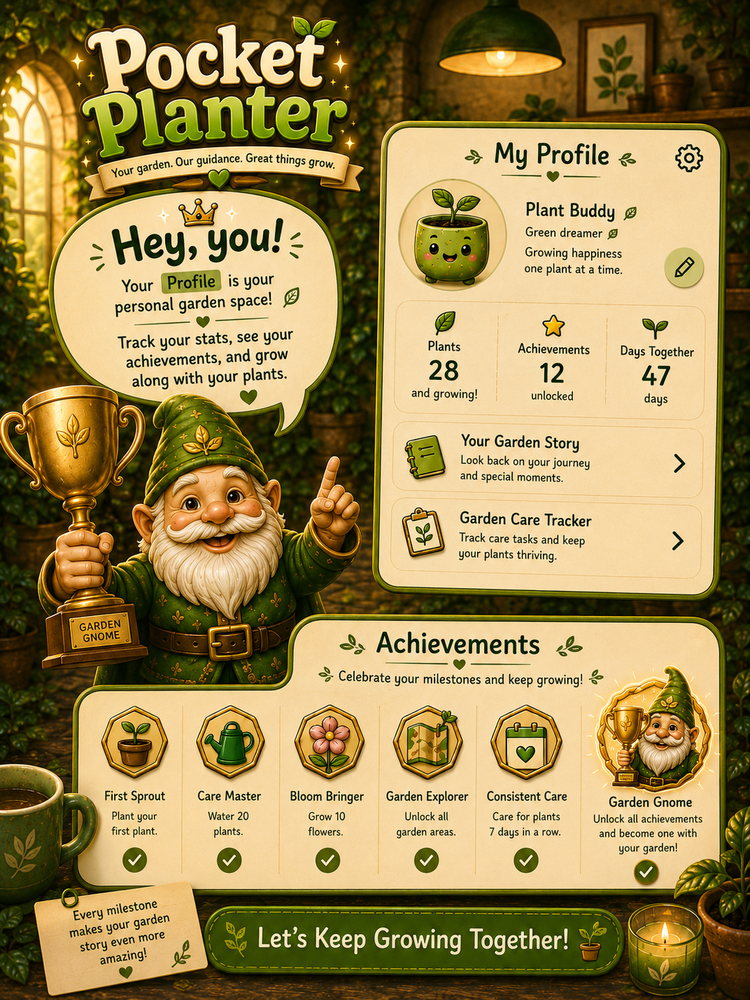
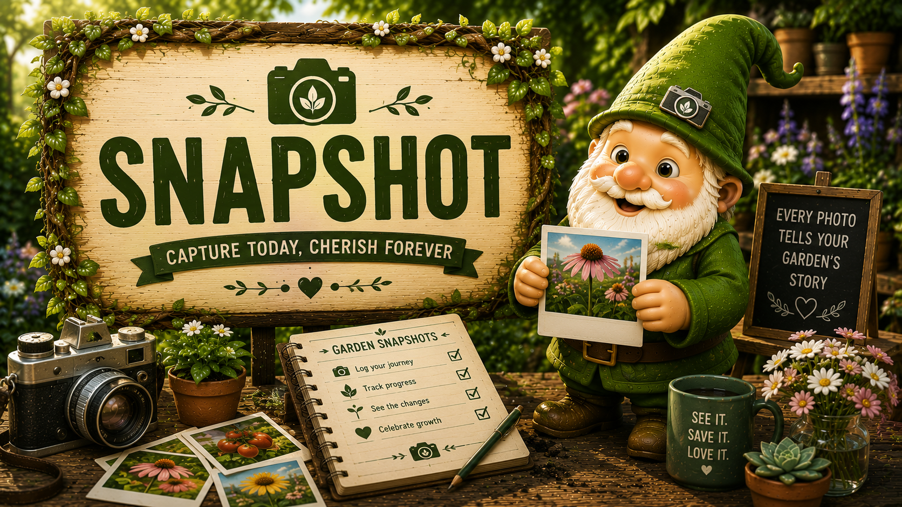
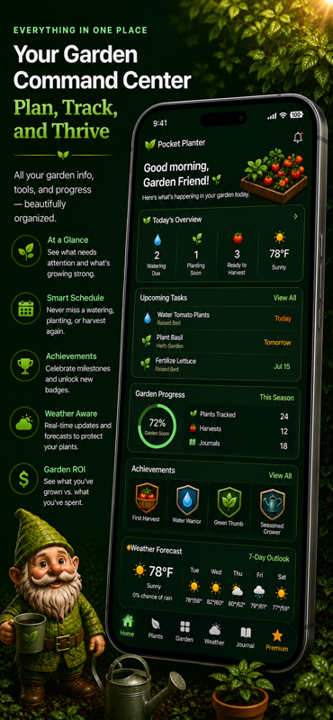

# 🌱 Pocket Planter

A mobile gardening companion designed to help people grow smarter, stay organized, and build a better connection with their plants.

---

## 📱 About Pocket Planter

Pocket Planter is a mobile application built to make gardening easier for everyone — from beginners planting their first seed to experienced gardeners managing multiple plants.

The idea behind Pocket Planter came from combining technology with a simple everyday activity: helping people understand their plants better.

The app provides personalized plant recommendations, garden organization tools, weather insights, and tracking features to create a more interactive gardening experience.

---

# ✨ Features

## 🌱 Plant Discovery

Explore plants and learn important information including:

- Growing requirements
- Planting information
- Difficulty levels
- Seasonal recommendations
- Plant care details

---

## 🪴 Garden Planner

Organize and manage your garden with tools designed to help users:

- Track plants
- Plan garden layouts
- Monitor progress
- Stay consistent with plant care

---

## 🌦 Weather Integration

Pocket Planter uses weather data to provide helpful gardening insights.

Features include:

- Local weather information
- Temperature tracking
- Rain probability
- Weather-based gardening recommendations

---

## 📖 Plant Journal

Keep track of your gardening journey:

- Save plant updates
- Record notes
- Track progress
- Document your growing experience

---

## 🔔 Smart Reminders

Stay on top of plant care with reminders for:

- Watering
- Planting schedules
- Garden tasks
- Seasonal activities

---

## ☁️ Cloud Accounts

User data is securely stored and synced through cloud services.

Includes:

- Account management
- Saved plants
- Garden information
- Journal entries
- User preferences

---

# 🛠 Technology Stack

## Frontend

- React Native
- Expo
- JavaScript

## Backend

- Supabase
- PostgreSQL Database
- Authentication
- Cloud Storage

## APIs & Services

- Open-Meteo Weather API
- External plant data sources

## Development Tools

- Git
- GitHub
- VS Code
- Expo EAS

---

# 📸 Screenshots

## App Icon


---

## Home Screen


---

## Plant Discovery



---

## Garden Planner



---

## Garden Assistant


---

## Weather Features



---

## Watering Features



---

## Profile



---

## App Banners




---

## Garden Command



---

# 🚀 Installation

Clone the repository:

```bash
git clone https://github.com/Barkyx16/YOUR-REPOSITORY-NAME.git

Navigate into the project:

cd Pocket-Planter

Install dependencies:

npm install

Start the application:

npx expo start
🧠 Development Journey

Building Pocket Planter has helped me grow as a software engineer by giving me experience with:

Building a complete mobile application
Designing user-focused experiences
Connecting applications to cloud databases
Integrating external APIs
Managing authentication and user data
Deploying applications for real users
🔮 Future Improvements

Future ideas for Pocket Planter include:

AI-powered gardening assistant
Plant disease detection
More personalized recommendations
Community gardening features
Advanced plant analytics
👨‍💻 Built By

Alex Rafalski

Software Engineer | Mobile App Developer

GitHub:
https://github.com/Barkyx16

